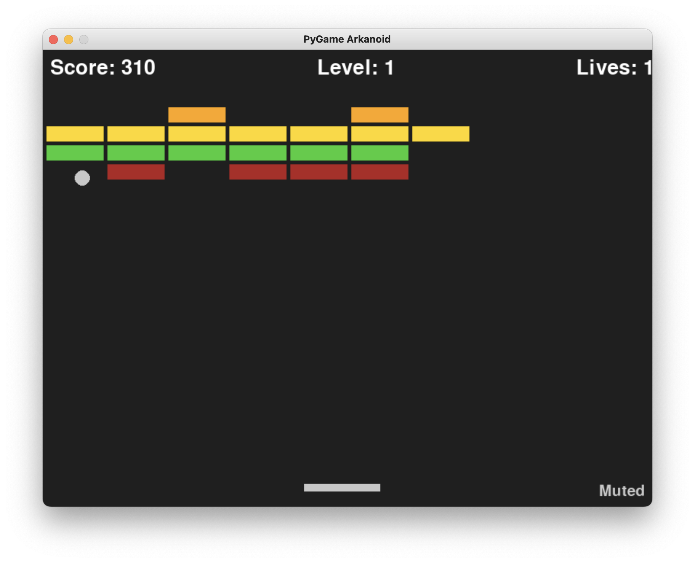

# 🎮 Arkanoid Game

This is my personal project created as a homework assignment during my **internship at EPAM**.

## 📌 Description

A classic **Arkanoid-style arcade game** built from scratch as part of my learning journey.  
The goal is to destroy all the bricks by bouncing a ball using a paddle.  
The game ends when all lives are lost.

## ✅ Features

- Core game mechanics: ball movement, paddle control, brick collisions.
- Multiple levels with increasing difficulty.
- **Mute Button** to toggle sound on/off.
- Enhanced gameplay with more diverse and challenging level design.

## 🕹️ Controls

- `←` / `→` — Move the paddle  
- `Space` / `Enter` — Start the game  
- `M` — Toggle sound

## 📷 Screenshots

> Example:  
> 

## 🚀 How to Run

Instructions vary based on implementation:

**Example (Python + Pygame):**
```bash
python main.py
